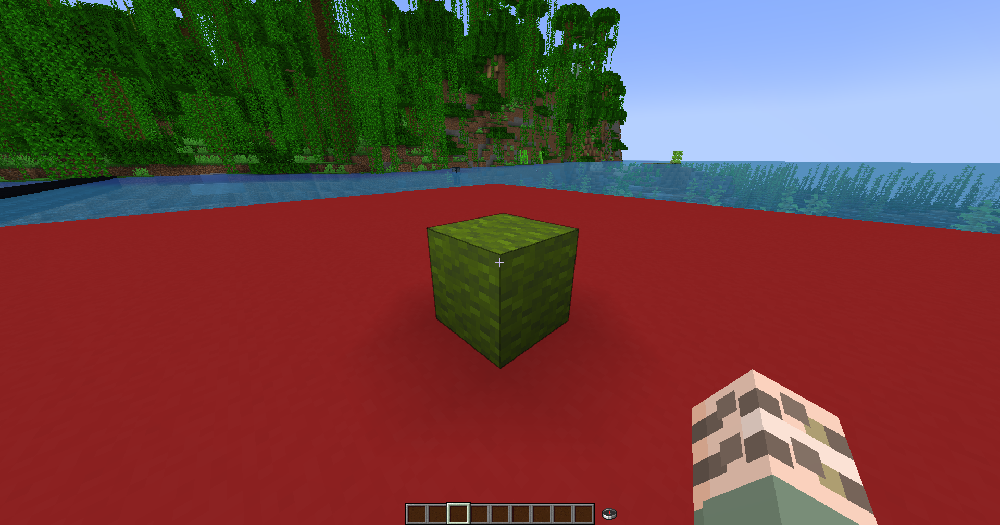

# compass
A custom compass that points at any direction you want

## Overview
Using a resourcepack to add custom images and positive space font. 
\The code calculates which images is needed to point at the right location. 
If the player doesn't want to navigate to a location, the compass spins around.

## Usage
Use the command /navigate to navigate to a location.
You only have to use the x and z from the location.
If you want the compass to stop pointing in a direction use /navigate stop.

Everyone is allowed to use the code and the resourcepack in you're own projects. Credits are not needed but would be appreciated.
